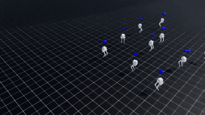
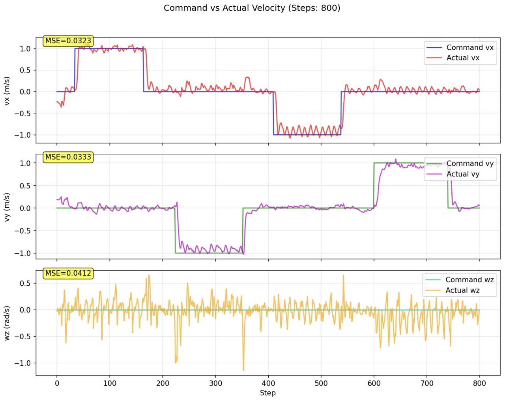
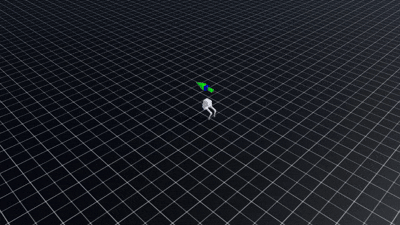

<p align="center">
    
    
</p>

# Bipedal Robot RL Locomotion Learning Project

[](https://docs.omniverse.nvidia.com/isaacsim/latest/overview.html)
[](https://isaac-sim.github.io/IsaacLab)
[](https://docs.python.org/3/whatsnew/3.10.html)
[](https://releases.ubuntu.com/20.04/)
[](https://pre-commit.com/)
[](https://opensource.org/license/mit)

## Overview

This repository is used to train and simulate bipedal robots, such as [limxdynamics TRON1](https://www.limxdynamics.com/en/tron1).
With the help of [IsaacLab](https://github.com/isaac-sim/IsaacLab), we can train the bipedal robots to walk in different environments, such as flat, rough, and stairs.

**Keywords:** isaaclab, locomotion, bipedal, pointfoot, TRON1

## Installation

- Install Isaaclab by following the [official installation guidance](https://isaac-sim.github.io/IsaacLab/v2.1.0/source/setup/installation/binaries_installation.html). We recommend using the miniconda installation as it simplifies calling Python scripts from the terminal.

**Attention:** Please switch to 2.1.0 branch in the official guidance if you want to use the learning project directly. **This project is designed for Isaaclab 2.1.0 + isaacsim 4.5.0.**

- Clone the repository:

```bash
# Option 1: HTTPS
git clone https://github.com/81578823/RL_bipedal_locomotion_Isaaclab.git

# Option 2: SSH
git clone git@github.com:81578823/RL_bipedal_locomotion_Isaaclab.git
```

```bash
# Enter the repository
conda activate isaaclab     # Or virtual environment you have created
cd RL_bipedal_locomotion_Isaaclab
```

- Using a python interpreter that has IsaacLab installed, install the library

```bash
python -m pip install -e exts/bipedal_locomotion
```

- To use the mlp branch, install the library

```bash
cd RL_bipedal_locomotion_Isaaclab/rsl_rl
python -m pip install -e .
```

## Set up IDE for convenience (Optional)

To setup the IDE, please follow these instructions:

- Replace the path in .vscode/settings.json with the Isaaclab and python paths used by the user. This way, when the user retrieves the official functions or variables of Isaaclab, they can directly jump into the definition of the configuration environment code.

And then you can use the ```F5``` key to debug this project, which will launch debug function following the setup in ```.vscode/launch.json```. You can modify launch.json to debug new tasks you design.

## Train a bipedal robot agent

- Use the `scripts/rsl_rl/train.py` script to run a simple robot training task, specifying the task:

```bash
python scripts/rsl_rl/train.py --task=Isaac-Limx-PF-Blind-Flat-v0 --headless

#or the following for rough terrains

python scripts/rsl_rl/train.py --task=Isaac-Limx-PF-Blind-Rough-v0 --headless
```

- The following arguments can be used to customize the training:
    * --headless: Run the simulation in headless mode
    * --num_envs: Number of parallel environments to run
    * --max_iterations: Maximum number of training iterations
    * --save_interval: Interval to save the model
    * --seed: Seed for the random number generator

## Play the trained model

- To play a trained model:

```bash
#this is for flat terrain
python scripts/rsl_rl/play.py --task=Isaac-Limx-PF-Blind-Flat-Play-v0 --num_envs=10

#this is for multi-terrains
python3 scripts/rsl_rl/play.py   --task=Isaac-Limx-PF-Blind-Rough-Play-Near-v0   --checkpoint_path=/path_to_ckpt  --num_envs=1 --video --video_length 800
```

- The following arguments can be used to customize the playing:
    * --num_envs: Number of parallel environments to run
    * --headless: Run the simulation in headless mode
    * --checkpoint_path: Path to the checkpoint to load
    * --video: whether to load video or not, it is highly recommended to load the video.
    * --video_length: how many steps you would like to load the video
- The following are some keyboard commands for in the play.py script:
    * Directions1:
     W:forward,A:leftward,S:backward,D:rightward.
    * Directions2: play.py also supports gamepads if you could connnect it with the computer.
    * Push forces: 1:push forward,2:push leftward,3:push backward,4:push rightward.
    * the value of the commands could be adjusted in play.py.
- play.py also supports angular and linear velocity tracking

## Video Demonstration

### Simulation in IsaacLab
- **multi-terrain-traversal**:


- **high accuracy speed tracking**:



<p align="center">
    
</p>

- **high pushing limit**:

